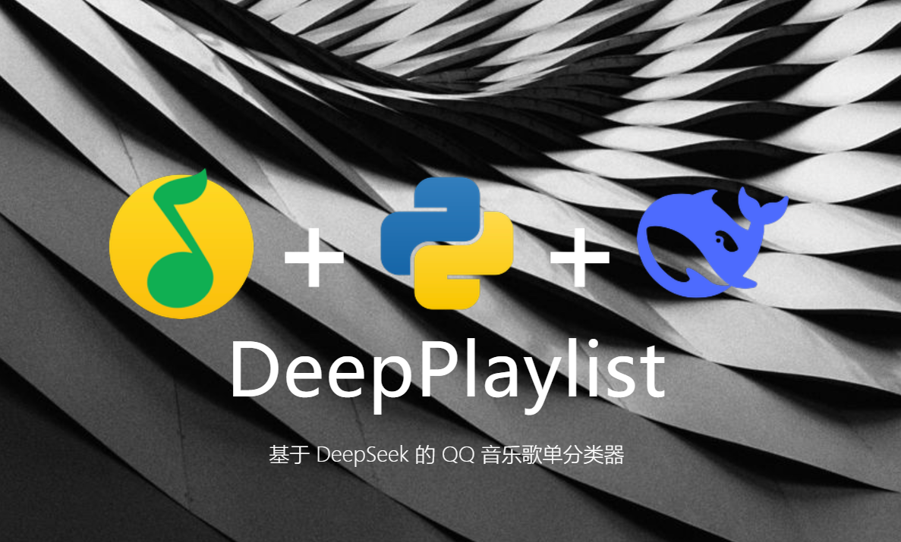

<div align="center">

  <!---->
<p align="center">
  
</p>

  <p align="center">
  <a href="https://huggingface.co/deepseek-ai/deepseek-coder-14b-instruct"></a>
  <a href="https://www.python.org"></a>
  <a href="https://github.com/Steven-ZN/DeepPlaylist?tab=MIT-1-ov-file"></a>
  <a href="https://github.com/Steven-ZN/DeepPlaylist/stargazers"></a>
</p>

</div>


> [!IMPORTANT]
> 本仓库的所有内容仅供学习和参考之用，禁止用于商业用途
> 
> 本仓库依赖 [luren-dc/QQMusicApi](https://github.com/luren-dc/QQMusicApi) 实现登录和歌曲信息获取
> 
> **音乐平台不易，请尊重版权，支持正版。**

## 简介

DeepPlaylist 是一个基于 DeepSeek 模型和 QQ 音乐 API 的自动歌单分类系统。通过调用本地部署的 LLM（如 Ollama 支持的 DeepSeek），默认功能是结合喜欢的歌曲数据，为用户生成情绪与语言分类，并自动归类进歌单；但你也可以修改prompt和相关变量实现自定义。

## 特点

* 全流程本地化运行，无需联网调用大模型
* 基于 DeepSeek 语义理解，实现高质量标签归类
* 自定义 prompt 和分类变量，适配任意标签体系
* 可自动创建分类歌单并上传到 QQ 音乐

## 安装

```bash
pip install qqmusic-api-python
```

确保本地安装并运行 Ollama，并已加载 deepseek 模型：

```bash
# 下载 DeepSeek R1 14B 模型（请确保显存充足，建议16GB以上）
ollama pull deepseek-r1:14b

# 启动模型服务
ollama run deepseek-r1:14b

```

## 使用

### 1. 登录&生成歌曲数据

```bash
python main.py
```

首次运行会弹出二维码扫码登录，成功后会在本地生成 `liked_songs.csv`。

### 2. 进行分类

```bash
python classification_deepseek.py
```

自动读取 liked\_songs.csv，调用本地 DeepSeek 模型生成标签，输出为 `classified_songs.csv`。

### 3. 自动分类检查缺失项&调用deepseek补全

```bash
python fix_classified_songs.py
```

根据 `classified_songs.csv` 中的分类内容，检查分类为空或被deepseek错误填写（如“-”）的内容，进行补全修复。
## 结构

* `main.py`：登录账号并下载喜欢的歌曲
* `classification_deepseek.py`：通过 DeepSeek 模型进行json生成
* `upload.py`：创建并上传分类歌单

### 4. 上传&自动分类

```bash
python upload.py
```

根据修复后的 `classified_songs.csv` 中的标签创建对应歌单并上传。


## 技术栈

* Python 3.10+
* Ollama + DeepSeek 模型
* qqmusic-api-python（基于 luren-dc/QQMusicApi）

## 贡献

欢迎提交 PR 与 Issue。


## License

MIT License


